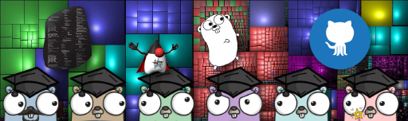

# #100DaysOfCode Log - Round 1 - CodeFreezr

The log of my #100DaysOfCode challenge. Started on [January 23, Tuesday, 2018]

Table of Contents
=================

* 1-10   
[d01](#r1d1) [d02](#r1d2) [d03](#r1d3) [d04](#r1d4) [d05](#r1d5) [d06](#r1d6) [d07](#r1d7) [d08](#r1d8) [d09](#r1d9) [d10](#r1d10)  
* 11-20  
[d11](#r1d11) [d12](#r1d12) [d13/14](#r1d1314) [d15/16](#r1d1516) [d17](#r1d17) [d18](#r1d18) [d19](#r1d19) [d20](#r1d20)
* 21-30  
[d21](#r1d21) [d22](#r1d22) [d23](#r1d23) [d24](#r1d24) [d25](#r1d25) [d26](#r1d26) [d27](#r1d27) [d28](#r1d28) [d29](#r1d29) [d30](#r1d30)
* 31-40  
[d31](#r1d31) [d32](#r1d32) [d33](#r1d33) [d34](#r1d34) [d35](#r1d35) [d36](#r1d36) [d37](#r1d37) [d38](#r1d38) [d39a](#r1d39a) [d39b](#r1d39b) [d40](#r1d40)
* 41-51    
[d41](#r1d41) [d42](#r1d42) [d43](#r1d43) [d44](#r1d44) [d45](#r1d45) [d46\+47](#r1d4647) [d48\+49](#r1d4849) [d50\+51](#r1d5051)   
* 52-60   
[d52](#r1d52) [d53](#r1d53) [d54](#r1d54) [d55\+56](#r1d5556) [d57](#r1d57) [d58](#r1d58) [d59](#r1d59) [d60](#r1d60)
* 61-...   
 [d61](#r1d61) [d62](#r1d62) [d63](#r1d63)

---

## Log

### R1D1 
   
My first day was an excurse in understanding the twitter retweet bot from 100DaysOfCode.  
[tweet-r1d1](https://twitter.com/DetlefBurkhardt/status/955468052396724224)

### R1D2 
   
Arrange & setup my 100 Days challenge. And by the way: Imho Coding means Reading. To write excellent code like poetry it is important to read the best code you can get in the area you want to grow.  
[tweet-r1d2](https://twitter.com/DetlefBurkhardt/status/955889157565542400)

### R1D3
   
Today I decide how my 100 day curriculum should look-a-like.  
[tweet-r1d3](https://twitter.com/DetlefBurkhardt/status/956133235083436033)

### R1D4
   
One of my main targets collecting a valuable and reliable golang code corpus. So I can create some SCA Tools, incorporate testing and a streamlined go playground integration.  
[tweet-r1d4](https://twitter.com/DetlefBurkhardt/status/956660194943078401)

### R1D5
   
Day 5 was a more »laborized«-day. It was about walking and failing, content preparing, data cleansing, code experiments with travesing filesystems, thx to filepath.Walk(). Searching and alienating.  
[tweet-r1d5](https://twitter.com/DetlefBurkhardt/status/957192967156051968)

### R1D6
   
Done Clustering of the StdLib, add 4 new gobyes, remove 2. Tried GoReportCard and play around with goplay CLI to get shareable URL's for the go playground.  
[tweet-r1d6](https://twitter.com/DetlefBurkhardt/status/957824970192760832)

### R1D7
   
After repairing the winter-crash of the windows insider upate, now Build 17074, I was able to re-install about the half of my non-microsoft tools. *grr*. But anyway, I could add some really awesome gobyes.
[tweet-r1d7](https://twitter.com/DetlefBurkhardt/status/958496414975348736)

### R1D8
   
My first week was shaped by building the foundation. Beside digging into sort and and flag go package, I added 23 gobyes repositories and created an additional goby-incubator projects for repos which I want to check before adding to the main. The most exciting discovery today was the world of github badges. After GoReportCard I found the overwhelming shields.io solution.
[tweet-r1d8](https://twitter.com/DetlefBurkhardt/status/959015208139272192)

### R1D9
   
Slowly swinging into the finishing straight. Main decision for today was to cut out three repos into the incubator and add another six news, mainly from paperback books. Add a smart mini-navbar so you can step from gobye to gobye. Next, greater challenge is to build a central, streamlined navigation structure. This sounds like a bit more direct go coding, finally.  
[tweet-r1d9](https://twitter.com/DetlefBurkhardt/status/959991330985439232)

### R1D10

Refactor the folder structure, prepare tagging all the go-files and incroporate some sloc/cloc/ncss calculations.
[tweet-r1d10](https://twitter.com/DetlefBurkhardt/status/960258486293712897)

### R1D11
  
Struggling with non-forking os-processes in go ...  
[tweet-r1d11](https://twitter.com/DetlefBurkhardt/status/960311008878317568)

### R1D12
  
Solve some gobye challenges with groovy...  
[tweet-r1d12](https://twitter.com/DetlefBurkhardt/status/960667400977907712)

### R1D13/14
  
Just ill. Added some gobyes from Packt. Sorted some to the incubator, and try to get on track again.  
[tweet-r1d13+14](https://twitter.com/DetlefBurkhardt/status/961214901619392512)

### R1D15/16
  
Still ill. From bed I can just read alot. I investigate a bit in the github pages stuff. You get an absolut free hosting service with just an "git push" publishing process to an [user].github.io/project URL. That's awesome. Drawback: Autopublishing schedulde around every 5 minutes only, and max size is 1GB. So I decide to use gobeys/docs options to split the #golang code corpus from github publishing, not to run in troubles.  
[tweet-r1d15+16](https://twitter.com/DetlefBurkhardt/status/961960643883610112)

### R1D17
  
A short sidekick: catching some of the twitter #hashflags see: link.
A first PoC of our #gobye reading environment is ready see: link.
Now we have link to automate the rest of the corpus   
[tweet-r1d17](https://twitter.com/DetlefBurkhardt/status/962134060389883905)

### R1D18:
  
Today I start to activate RosettaCode as a another gobye repository. This is a bit tricky because the export is an odd mix of xml and wiki markup. Another challenge are the wide spreaded, different using of the capitilisation rules and the use of special signs in the url.  
[tweet-r1d18](https://twitter.com/DetlefBurkhardt/status/962616453311672321)

### R1D19:
That RosettaCode Trip will take a bit longer, because I'dont want not only add a new gobey-repository. I'm very interested also to add code for some tasks in go, groovy and perhaps typescript / javascript. Based on the Idea of DrThomasMüller I collect all RosettaCode Task in Java, which are no grooynized.  
For this I have prepared a lot of #groovy-code to extract and streamline a lot of very clever go algorithm today. Enhance my gobye UX POC and decide to investigate a bit more in a vanila js tree navigation. My learnings for today was reading / writing csv, creating a very generic vanila http getter and create an all purpose search and replace util.  
[tweet-r1d19](https://twitter.com/DetlefBurkhardt/status/962843123679465472)

### R1D20: 
RosettaCode is not that easy. Just the numbers are more then impressive: 870 Programming Tasks, 206 in Draft. 681 Programming Languages, around 100 Categories and Sub-Categories with multiple parents assignment and everything without mindmap or dot-graph makes it really challenging to get an access to it. 
Another aspect are the data quality in the snippets and the category structure. From Typo's multiple root-trees with different semantics to classical SCA/Linting weakenings. With the help from golint, go vet, gofmt I could fix around 300 Issues, but there is no upstream interface. All the solutions I found was downstream and this for what ever reason not complete. 
So, Rosetta is a very high obstacle to climb. But even it costs some days, I hope I will have the power to crack the nut. Lets see.  
[tweet-r1d20](https://twitter.com/DetlefBurkhardt/status/963187321574223873)

### R1D21:
Today Lesson was handling Environment-Variables (get/set) in golang and groovy System-, Go-Process or JVM-wide. The main obstacles to create a multiplatform solution for windows and unix-based systems are different storage stragies files / registry.  
[tweet-r1d21](https://twitter.com/DetlefBurkhardt/status/963703619265712128)

### R1D22:
  
Finishing my investigation on handling environment variable and starting a multipurpose proxy switch for java/groovy, go, git, vscode etc. This could be helpfull if you work at day in a office behind a firewall and after-hour all this setting doesnt work anymore.  
[tweet-r1d22](https://twitter.com/DetlefBurkhardt/status/963939275778809857)

### R1D23:
Back-on-Track on analysing RosettaCode for incorporate this bigger repo into the gobye corpus. For this I surf through the most categories and collect them in a sheet: [rosettacode-by-nmbrs](https://codefreezr.github.io/rosettacode-by-nmbrs/) for preparing a grapviz or similiar visual representations.  
[tweet-r1d23](https://twitter.com/DetlefBurkhardt/status/964298528515346432)

### R1D24:
  
I've assembled a GraphViz out of Google-Doc Spreadsheet the easy way. With this analysis I'm able to set up to layout a hierarchical composition out of the net of RosettaCode Categories. To structure the examples a bit better for our gobye corpus. [tweet-r1d24](https://twitter.com/DetlefBurkhardt/status/964656045011415040)

### R1D25:
  
Today I started a a wider sidekick into VueJS / Bootstrap because there was a interesting offer about a facelift of a homepage from in a timetunnel from 1984 > 2018... Huhuuu...  
[tweet-r1d25](https://twitter.com/DetlefBurkhardt/status/965153188105113600)

### R1D26
  
1) [Hello World with a vue](https://jsfiddle.net/Lq9qnzmg/18/)
2) [Simple Vue-CSS-Class Wizardry](https://jsfiddle.net/CodeFreezr/me1fjau3/10/)
3) [v- directices like if, then, else, show](https://jsfiddle.net/CodeFreezr/hc950mLj/2/)
4) [Filter pipelines](https://jsfiddle.net/CodeFreezr/e5kknuoL/13/)
5) [Component - Very Basics](https://jsfiddle.net/CodeFreezr/kgfyqxrf/19/)  
After some very, very Basic I get wet and scaffold some examples with the vue-cli and webpack.  
Great Finding: http://yuche.github.io/vue-strap/  
[tweet-r1d26](https://twitter.com/DetlefBurkhardt/status/965529167746994178)  

### R1D27
Jumping into the world of SSG via netlify. After testing a lot solutions hugo seems to be my fav.  
[tweet-r1d27](https://twitter.com/DetlefBurkhardt/status/966007155060101121)  

### R1D28
  
Second Day of Hugo: Fun Pur.  
[tweet-r1d28](https://twitter.com/DetlefBurkhardt/status/966384242837131269)

### R1D29 
Learned about Twitter Cards, update gobyes repo  
[tweet-r1d29](https://twitter.com/DetlefBurkhardt/status/966788811744309248)

### R1D30 
  
From rosettacode.org via github.com/rosettacodedata to codefreezr/rosettacode-to-go to the gobyes corpus.    
[tweet-r1d30](https://twitter.com/DetlefBurkhardt/status/967331064552345600)

### R1D31
  
Today I have setup an awesome-graphviz list and curated around 400 Entries. Tough...  
[tweet-r1d31](https://twitter.com/DetlefBurkhardt/status/967909244044562432)

### R1D32
  
Today I published this list, becaus it's not perfect, but ok for a first public viewing.  
[tweet-r1d32](https://twitter.com/DetlefBurkhardt/status/968280561096757248)

### R1D33:
  
As of today is now Tuesday a Vuesday. At least on this one day I wanna focus on vueJS to become comfortable with this stuff. The community is awesome, and it's not so "cutting changes" every nth release, like on angular.  
[tweet-r1d33](https://twitter.com/DetlefBurkhardt/status/968597835577987073)

### R1D34:
Not really happy about Groovy today, because handling gzip url-request content would through me back into alot of native java boilerplate, I want never see again. So I'm happy to be able to handle this stuff with golang. Hey, I even never feel it, that the REST Transmistion was gzip encapsulated. Bravo!  
[tweet-r1d34](https://twitter.com/DetlefBurkhardt/status/969009969998778368)

### R1D35:
Today I've learned alot about the wonderfull Stackexchange API to get stuff from Stackoverflow. An ideal example of an API documentation, greate Learning ressource. As a first apprentice piece I've analysed a couple of tag communities how active they are, and what the level of quality you can expect. Published a draft here: http://bit.ly/api-stackx  
[tweet-r1d35](https://twitter.com/DetlefBurkhardt/status/969355131048382474)

### R1D36: 
  
New flex layout (https://css-tricks.com/snippets/css/a-guide-to-flexbox/)  
font-awesome (cheat-sheet)   
axios for vueJS (list of tutorials)   
[tweet-r1d36](https://twitter.com/DetlefBurkhardt/status/969943501742931968)

### R1D37:
   
Day of Fixing stuff. Damny min-height nearly damaged my smart nested flexbox layout. Another Thing: I started a Hugo Theme. Worktitle: "Lucent-Condensed". And I buy my first Udemy Course from Maximilian.  
[tweet-r1d37](https://twitter.com/DetlefBurkhardt/status/970395485239480322)

### R1D38: 
Incubator cleanup, Nathany und Astaxie update.  
[tweet-r1d38](https://twitter.com/DetlefBurkhardt/status/970630364346580997)

### R1D39a: 
Cleanup my codelabs.  
[tweet-r1d38a](https://twitter.com/DetlefBurkhardt/status/970910655044898816)

### R1D39b: 
Markdown, HTML, Hugo SSG  
[tweet-r1d39b](https://twitter.com/DetlefBurkhardt/status/971477129757151234)

### R1D40: 
awesome graphviz cleanup in the webeditor-section, Check position-attribute for nodes. Found out, that you can multiple arrowheads on an edge like pearls on a row.  
[tweet-r1d40](https://twitter.com/DetlefBurkhardt/status/971903115489398784)

### R1D41:
  
Deeper and Deeper into Hugo SSG-Themes  
[tweet-r1d41](https://twitter.com/DetlefBurkhardt/status/972255385930387456)  

### R1D42:
Scribble, Sketching, Mockup & building Prototype.   
[tweet-r1d42](https://twitter.com/DetlefBurkhardt/status/972767432766054400)

### R1D43:
  
Digging into HugoSSG and start to check how to combine vuejs and hugo.  
[tweet-r1d43](https://twitter.com/DetlefBurkhardt/status/973233596147355648)

### R1D44:
Hacking Hugo-Themes. Experimenting how to create awesome Theme-Documentation  
[tweet-r1d44](https://twitter.com/DetlefBurkhardt/status/973803609967251456)

### R1D45:
Experimenting alot with the jfrog cli  
[tweet-r1d45](https://twitter.com/DetlefBurkhardt/status/974423885260247041)

### R1D46+47:
  
Two things today & yesterday for my learning course. (a) Analysing more Hugo-Themes  
[tweet-r1d46+47](https://twitter.com/DetlefBurkhardt/status/975128540499857409)  

### R1D48+49:
  
Same stuff than the last three day.  
[tweet-r1d47+48](https://twitter.com/DetlefBurkhardt/status/975825883155050496)  

### R1D50+51:
  
Mittagspause.   
[tweet-r1d50+51](https://twitter.com/DetlefBurkhardt/status/976771903607263232)

### R1D52:
  
Walker and Recursion in golang. Created a nice du in go, and a func on gist for a number format.
[tweet-r1d52](https://twitter.com/DetlefBurkhardt/status/977136068360396800)

### R1D53:
  
Dugo is the linux du in go.  
[tweet-r1d53](https://twitter.com/DetlefBurkhardt/status/977316523193888771)

### R1D54:
    
(1) Recursion ain't evil  
(2) otherwise or not call (1)   
  
Non-Recursion is also not a solution... damn!  
  
For now I put my #golang #hugoSSG #Themedog a bit on hold to focus back on the #graphviz.org revamp itself. Hope that delights @magneticnorth in the cold NJ.  
[tweet-r1d54](https://twitter.com/DetlefBurkhardt/status/978054312164282368)

### R1D55+56:
  
Jumping deep into the graphviz.org documentation to blast the monolithic pdf-documentation into hundres of single markdown files. So that is possible to wirk with them in a wiki-approach.  
[tweet-r1d55+56](https://twitter.com/DetlefBurkhardt/status/978660251347152897)

### R1D57:
  
Slurping JSON an creating a lot of markdown files today.
[tweet-r1d57](https://twitter.com/DetlefBurkhardt/status/979081503073296385)

### R1D58:  
  
Nested Sections works only with Hugo version 0.22 and up... Gnarf ... Alot guides, videos, tipps, tricks and workaround are older or even did not mention this version change.   
[tweet-r1d58](https://twitter.com/DetlefBurkhardt/status/980202981097435136)

### R1D59:  
  
If you develop themes for hugo you have to consider dependencies to different hugo versions. And after theme and the hugo binary is content itself the third demension. Because of the different features of a theme the content has more ore less deep dependencies to a specific theme. Switching a theme could be not that easy. And not all content architecture is with all hugo versions compatible. This could makes things even more complicated if you can't managing the exact hugo version for e.g. on gitlab or netlify.    
Beyond we have over 210 themes and growing without deeper information or selectable filter about all the content requirements, hugo versions, feature support etc. pp. So I decide to start a tentatice codelab for hugo to elaborate the possibility to build a hugo-themes database. At first I would collect the entities and attributes like release-date, version, feature, ...   
[tweet-r1d59](https://twitter.com/DetlefBurkhardt/status/980785011715706881)

### R1D60:  
Analysing and inspecting 212 Hugo Themes. 27 of them fitting my technical requirements, 3 of them has the whished features. Next time I would write some SCA rules to automate this, and beforehand I would put all of this into a simple database.  
[tweet-r1d60](https://twitter.com/DetlefBurkhardt/status/981035697401364480)

### R1D61:
  

After analysing, here our top themes:  

#### Top Three:  
"hugo-theme-bleak" Great animations  
"hugo-theme-docdock" Perfect Section Based Navigation  
"hugo-theme-learn" Great Section Menu grav based, super source code with copy function  

#### Great Themes:  
"beautifulhugo" Origin of LucentSpring  
"cocoa-hugo-theme" Let's have a look  
"ghostwriter"   
"gohugo-theme-ananke"  
"grid-side"  
"herring-cove" good twitter  
"hpstr-hugo-theme" great menu but many errors  
"hugo-bare-min-theme" because of Debug-Output  
"hugo-base16-theme" nice dark theme, but no _index.md  
"hugo-classic" clear   
"hugo-code-editor-theme" dark blue  
"hugo-fabric"   
"hugo-future-imperfect" nice menu and search but no list templates  
"hugo-geo" nice layout-flip for smaller devices  
"hugo-hello-programmer-theme"   
"hugo-kiera"  
"hugo-now-ui" nice heade, menu and cards  
"hugo-theme-air" Fune Homepage with moving graph  
"hugo-theme-bootie-docs" Good Black Top  
"hugo-theme-introduction" Great Black with cool Homepage   
"hugo-theme-projecthub" nice Listpage with o-o  
"hugo-theme-revealjs" great dark slide.com look-a-like  
"hugo-theme-wave" nice grid heatmap  
[tweet-r1d61](https://twitter.com/DetlefBurkhardt/status/981440006576275456)

### R1D62:
  
Making some steps twowards the hugo-theme-database to provide a starting point for our hugo theme award 2018. #hugothemes2018  
[tweet-r1d62](https://twitter.com/DetlefBurkhardt/status/981663541676707841)  

### R1D63:
  
More preparation for the hugo-themes-award 2018.   
[tweet-r1d63](https://twitter.com/DetlefBurkhardt/status/982763193071292416)  

